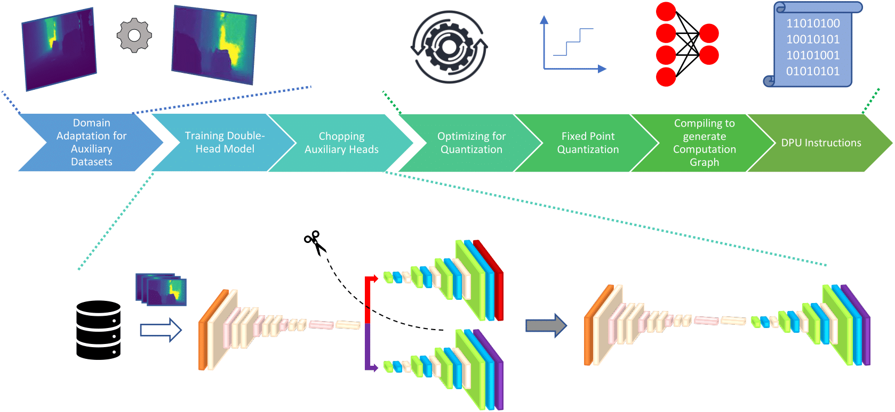

# FPGA Implementation of Double-Head SalsaNext: A CNN-Based Model for LiDAR Point Cloud Segmentation

This repository contains the code for the FPGA implementation of a customized double-head version of the SalsaNext model for semantic segmentation of LiDAR range images. The architecture of the model is illustrated below:

<p align="center">
  
</p>

The proposed pipeline is depicted in the following figure. For further details, please refer to our paper.

<p align="center">
  
</p>

## Quantization and Deployment

For quantization and deployment steps, please refer to [MiDaSFPGA](https://github.com/dymnmysn/MiDaSFPGA.git). After training, the steps remain the same; only the model differs, which can be incorporated with minimal code modifications.

## Acknowledgment

This repository includes code adapted from [SalsaNext](https://github.com/TiagoCortinhal/SalsaNext.git). We acknowledge the original authors for their contributions to the development of SalsaNext.

## Cite This Work 

If you use this code or any of the models, please cite our paper:  

```bibtex
@ARTICLE{hydrafpga,  
    author = "Adiyaman, M.Y. and Baskaya, F.",  
    title = "FPGA Implementation of Double-Head SalsaNext: A CNN-Based Model for LiDAR Point Cloud Segmentation",  
    journal = "...",  
    year = "2025",  
    volume = "...",  
    number = "..."  
}
```


## License

This project is licensed under the Apache 2.0 License.
